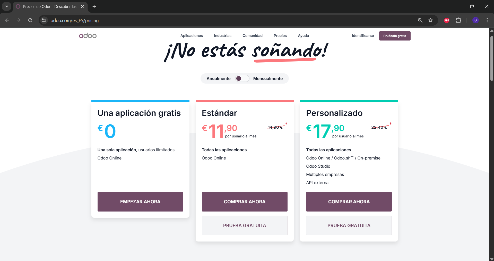
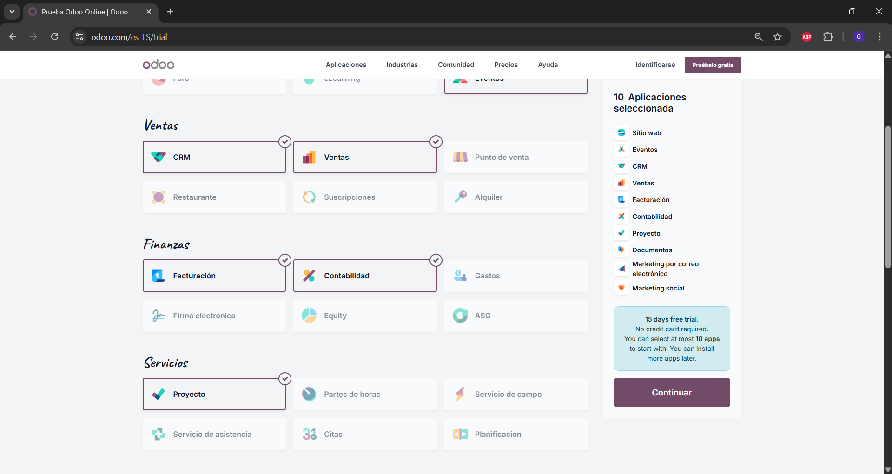
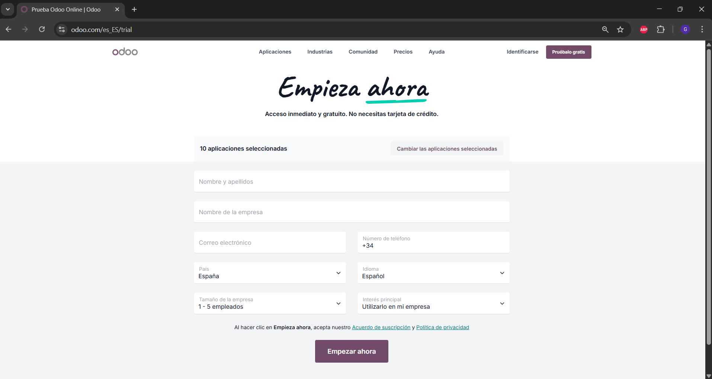
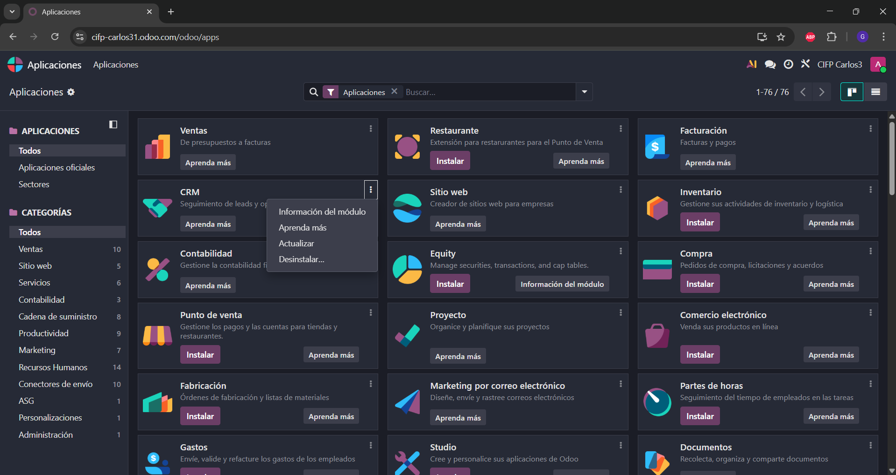

# 03 — Instalación y prueba (15 días) / Alta e instalación de apps

> Estructura orientativa

## Requisitos previos
- Navegador actualizado.
- Cuenta de correo para alta.

## Pasos
1. **Crear base de datos de prueba (15 días)** 
Lo primero que vamos a hacer es entrar a la página web de Odoo. Una vez dentro, iremos a la pestaña de precios. 

   

   Eligiremos la opcion gratuita de la estandar

   
   
2. **Seleccionar apps iniciales** 
Despues de haber seleccionado la prueba gratuita, nos da a elegir 10 aplicaciones

   -

   Una vez elegidas, nos registramos completando los campos 

    

   Al terminar el registro, se nos pedira que activemos la base de datos, la activamos y nos llega un mail para activarla, al hacerlo ya se te abrira la pagina sin ningun error

  

3. **Instalar/Desinstalar apps** 

   Una vez dentro le damos a la opcion aplicaciones

    

   Para instalar solo buscaremos la aplicacion que queramos y le damos al boton de instalar.
   Para desinstalar le daremos click a los 3 puntitos que nos aparecen en las aplicaciones para la opcion de desinstalar 

    

   Hay que tener cuidado ya que si desinstalamos algo vamos a perder todos los datos de la aplicacion 

