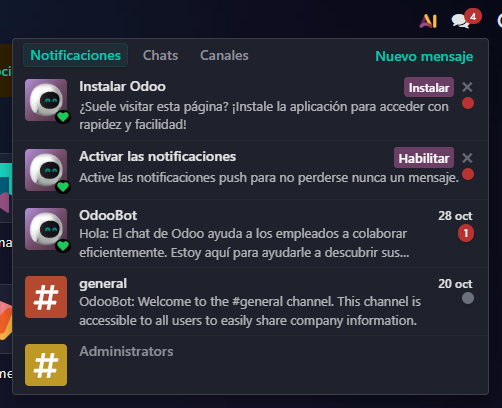
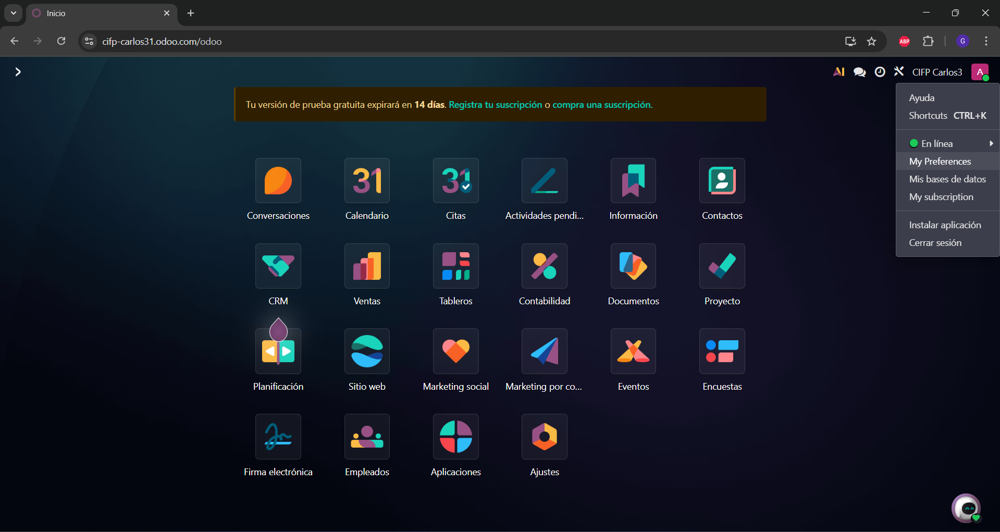
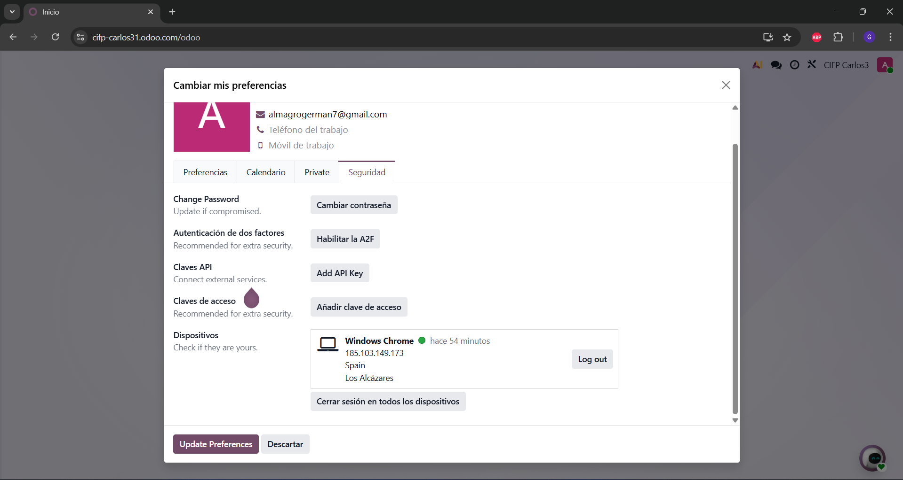
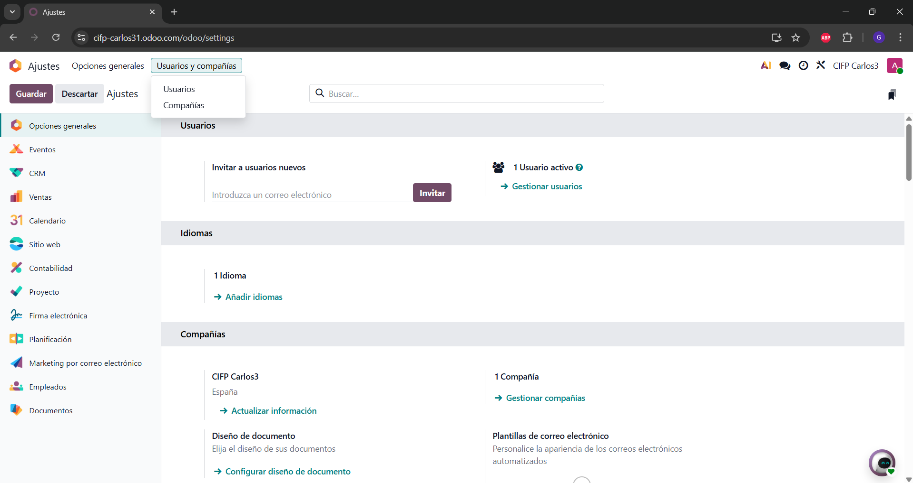
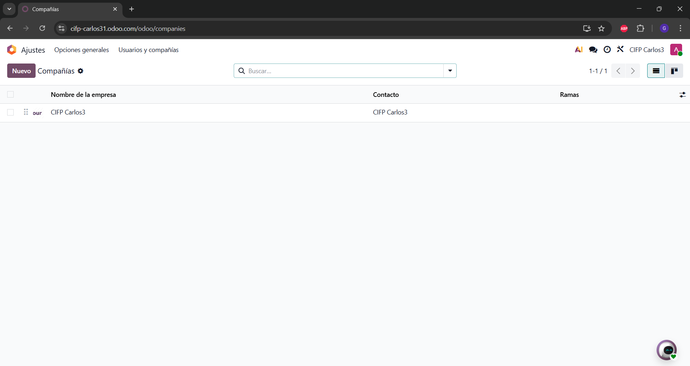
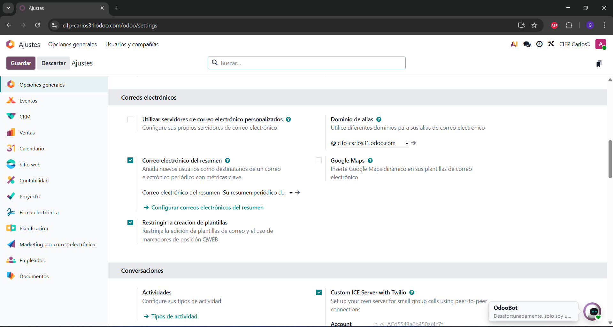
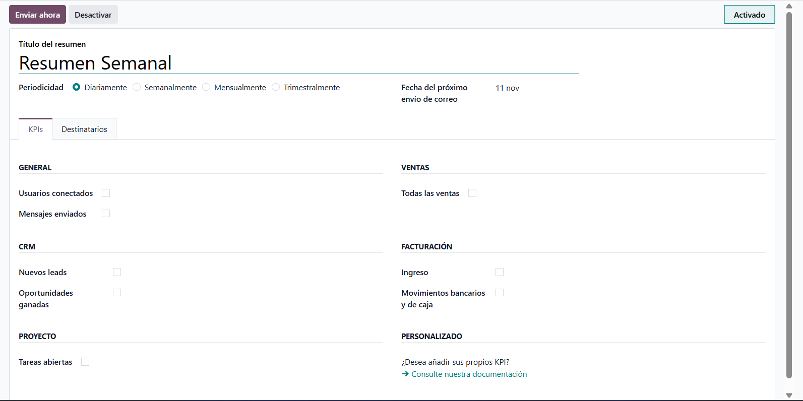

# 04 — Ajustes generales

> Estructura orientativa

- Activar **notificaciones** y (opcional) **PWA**.

Para activar las notificaciones unicamente le daremos a Habilitar en la pestaña de notificaciones

-

## Perfil: 

Para editarlo, nos iremos a la esquina de arriba derecha y le damos a my preferences

-

En la opcion de seguridad tenemos que activar la autenticacion de dos factores (A2F)

 -

- **Usuarios y compañías**

Dentro de ajustes, arriba del todo sale la opcion usuarios y compañias

-

-

-

En los usuarios podemos editar sus permisos, asignarles modulos.
En las compañias podemos ver sus datos tambien

- **Idiomas** y **diseño de documentos** 

En las opciones de ajustes tambein podemos añadir idiomas y configurar el diseño de nuestros documentos

-

- **Emails de resumen**: 

Los emails de resumen tambien se pueden configurar, para ello hay que darle a configurar correos electronicos del resumen
-

Podemos cambiarle la periocidad, y la informacion que queremos que nos llegue

-

