# 05 — Integración con Gmail (OAuth GCP + Add-on)

## Requisitos
- Cuenta Google Cloud (GCP).

## Pasos resumidos
1. **Activar plugin de correo** 

En Ajustes Generales y, dentro de esta pantalla, busca la sección de Integraciones.
Una vez allí, marca la casilla para activar el "Plugin de correo" y asegúrate de guardar los cambios en la esquina superior izquierda.

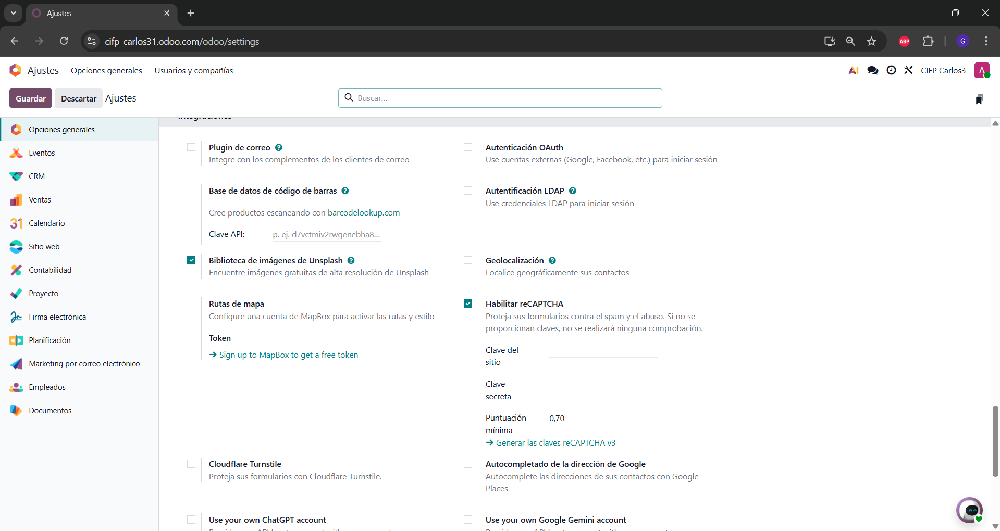

En gmail le daremos al + que aparece en la parte derecha e instalaremos el Odoo Inbox Addin

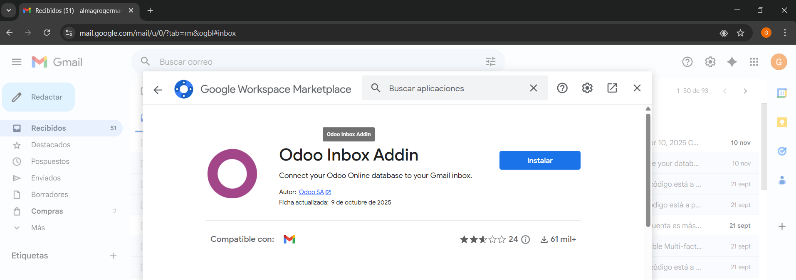

Iniciamos sesion y ponemos la url de nuestra base de datos

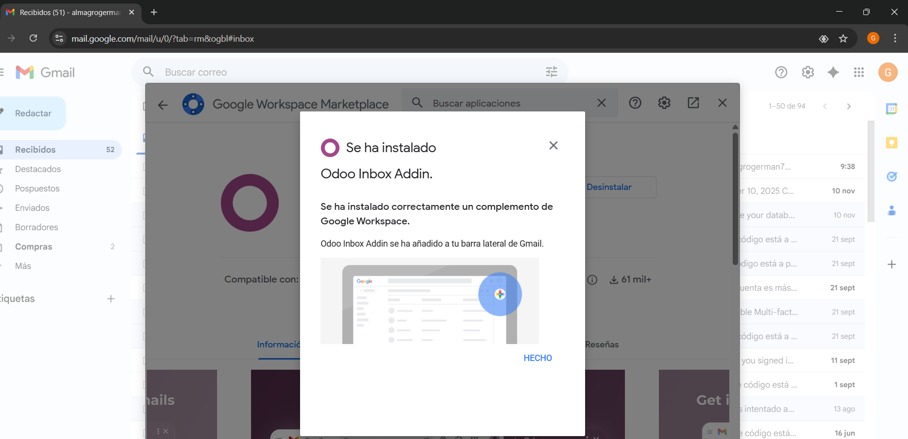

2. En **Google Cloud Console**:

En la misma pestaña de opciones seleccionaremos Autenticacion OAuth

En google, buscamos google cloud le daremos a crear proyecto y buscamos la api de gmail

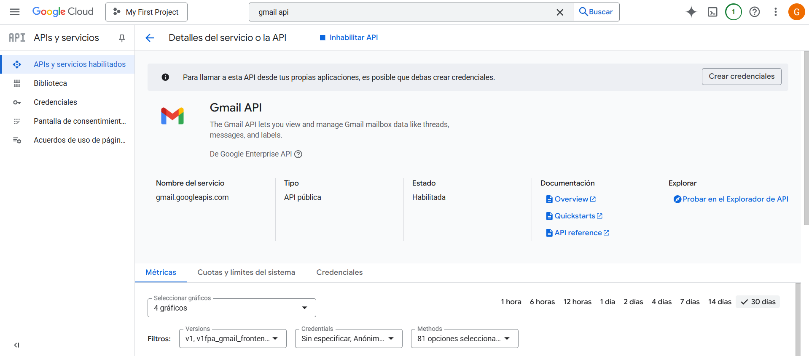

creamos los credenciales, en permisos, seleccionamos agregar o quitar permisos y buscamos google api, seleccionaremos esto:
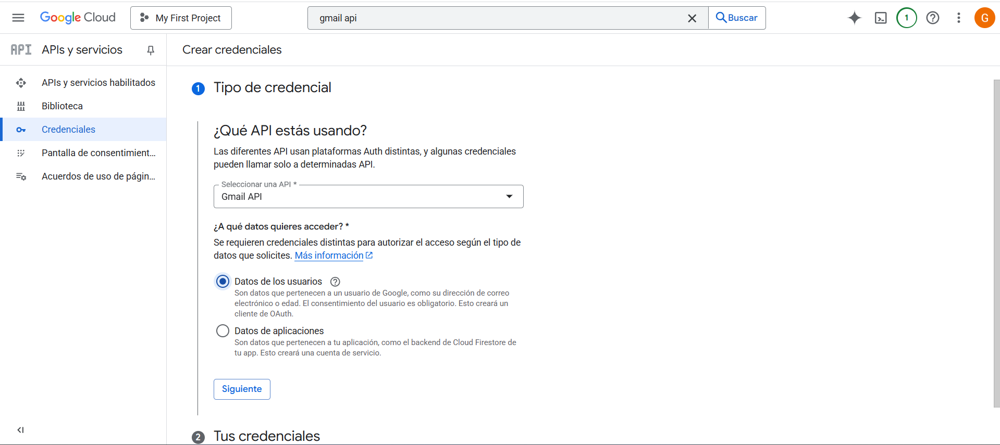

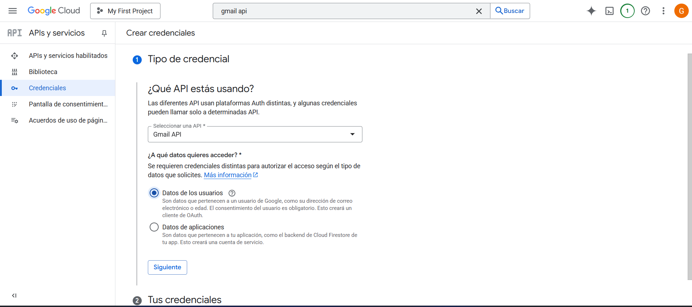

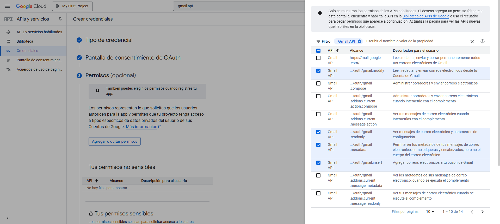

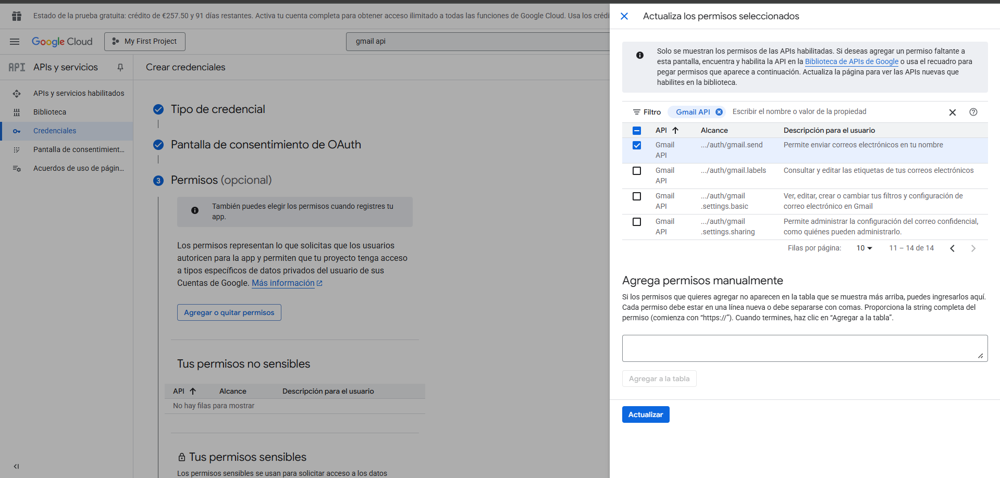

En la pantalla de credenciales seleccionamos la cuenta que hemos creado y rellenamos los datos

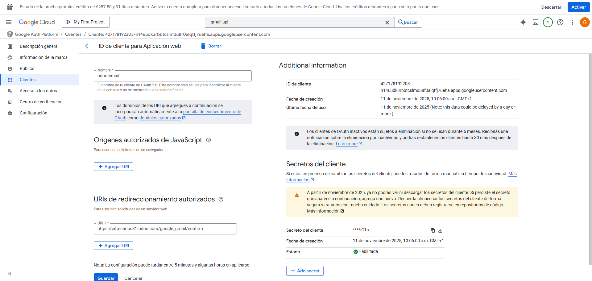

Volvemos a odo y ponemos la id del cliente, lo permitimos y guardamos 

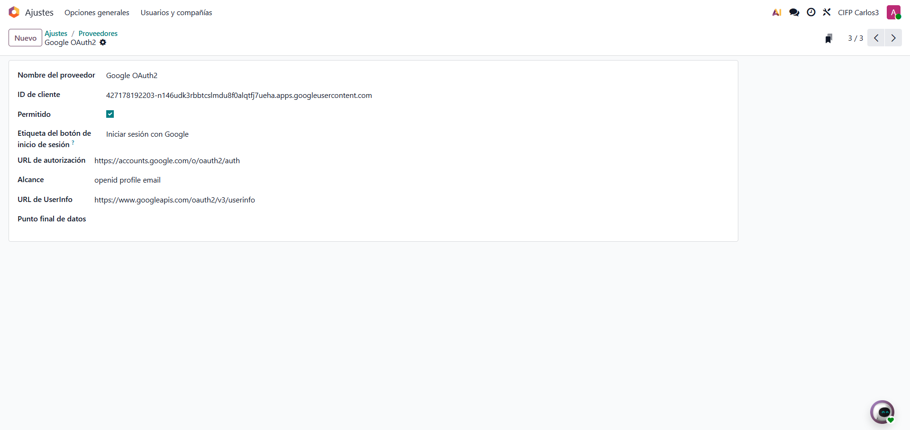

Y completamos los campos 

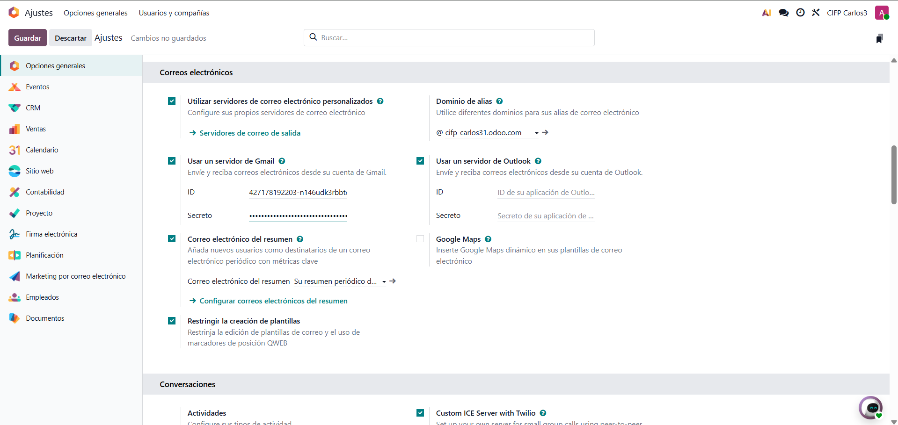

3. Copiar **Client ID/Secret** a Odoo 

