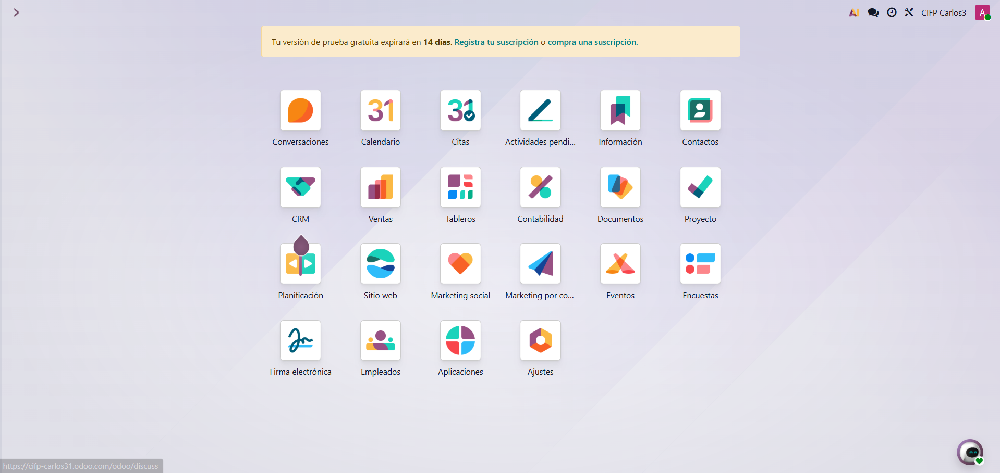
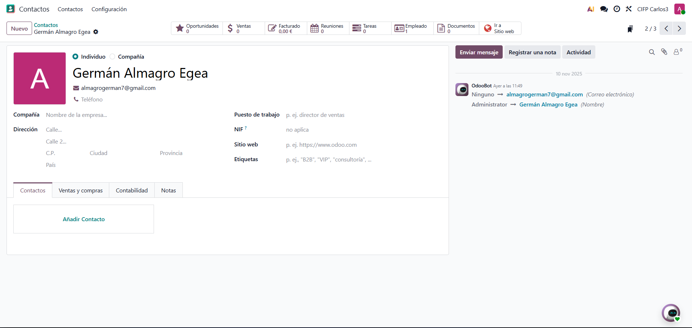
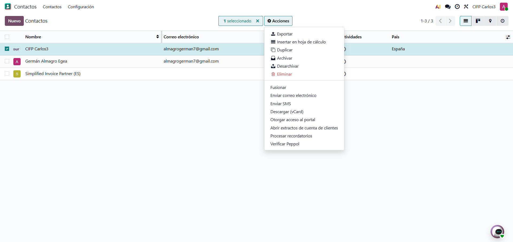
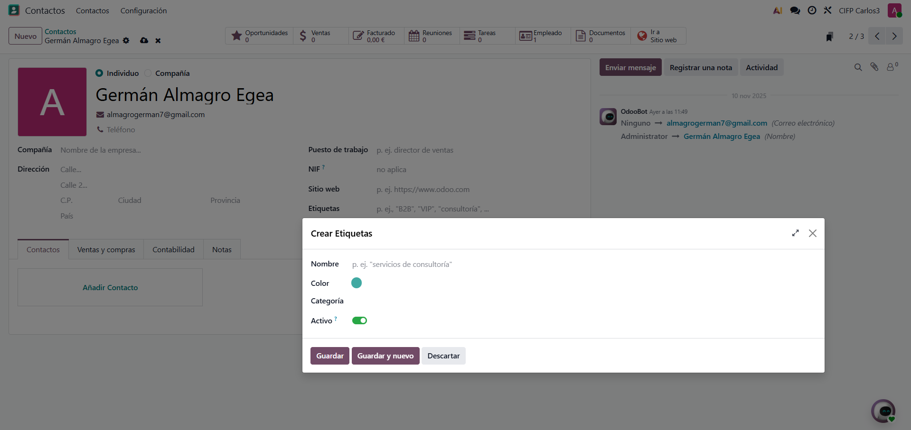
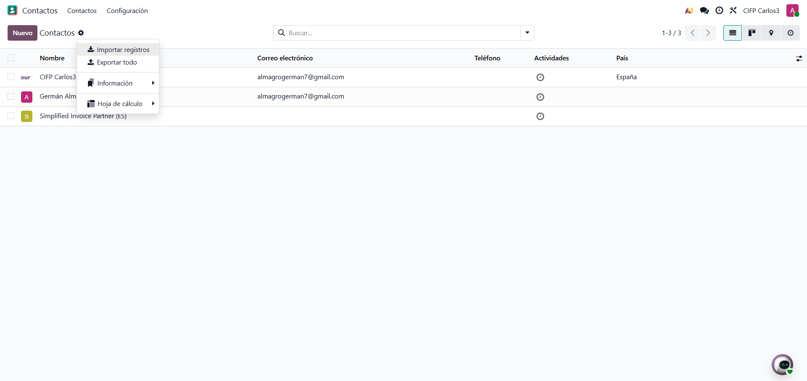
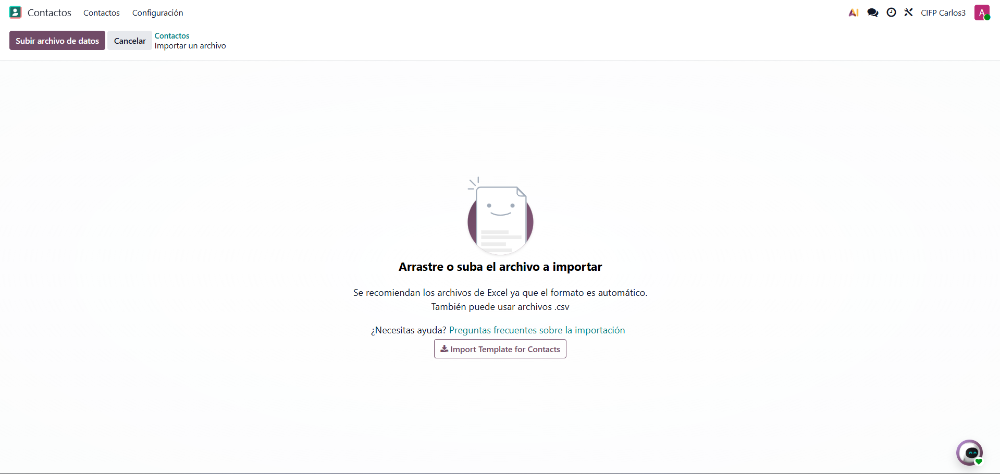
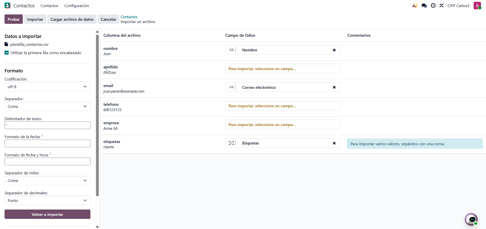

# 06 — Contactos

- Contactos

    En el menu seleccionamos contactos

    

    Podemos ver toda la informacion de nuestros contactos 

    

    Podemos ver las diferentes acciones que nos permite hacer odoo con nuestros contactos

    

- **Etiquetas** 

   Con las etiquetas podemos filtrar los contactos, es una buena practica y las podemos crear tanto como dentro del contacto como desde la configuracion

   

- Importación CSV 

Para importar le damos a la rueda de arriba y nos saldran varias opciones, le daremos a importar registros

Tendremos que configurar nosotros algunos de los campos si odoo no los reconoce, una vez hecho le damos a importar

