# 07 — Calendario y Citas

- Calendario (día/semana/mes) + disponibilidad del equipo.

    En el menu accedemos a calendario 

    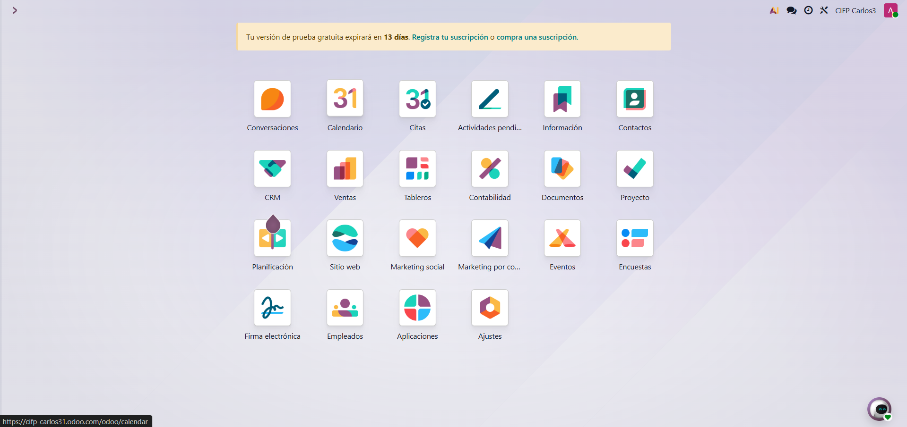

    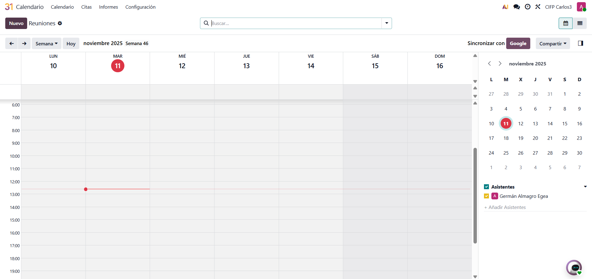

- **Integración con Google Calendar** 

    Repetimos los pasos que hicimos para la integracion de gmail.

    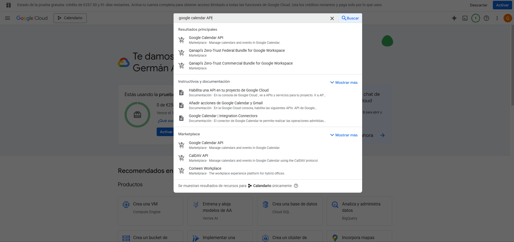

    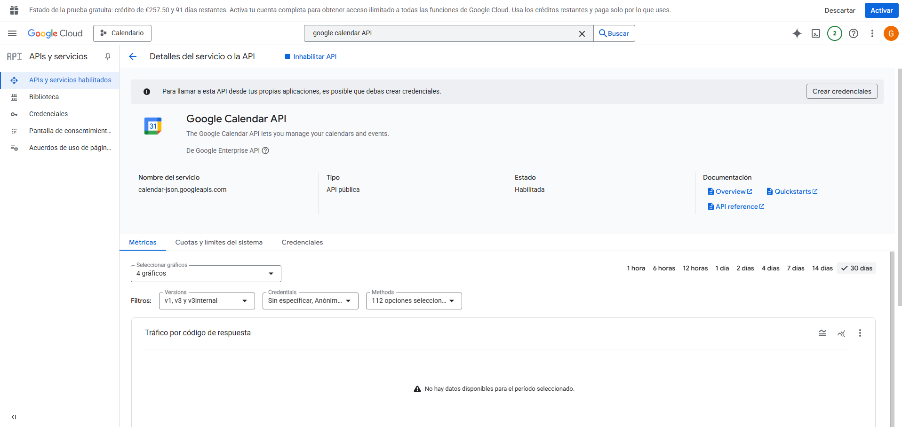

    Elegimos el permiso openid y todos los de google calendar API

    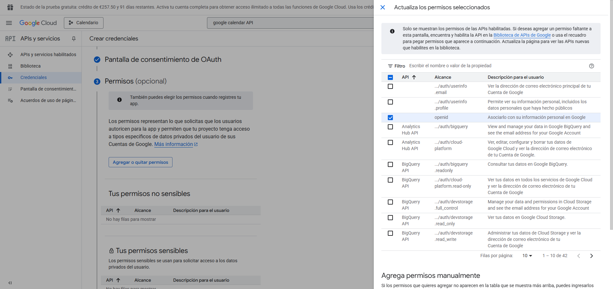

    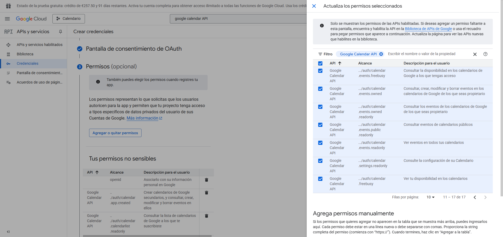

    rellenamos con nuestros datos

    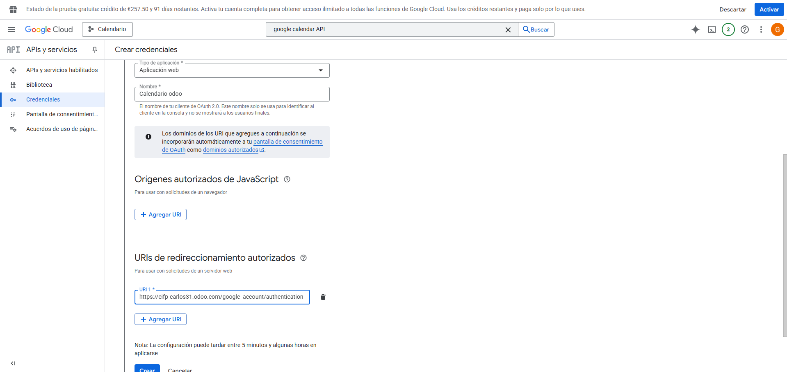

    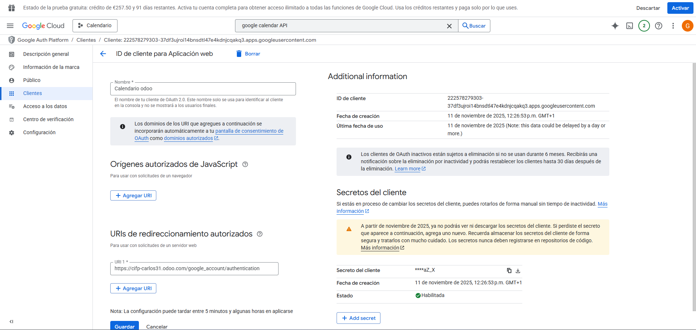

    Una vez rellenados, añadimos el id del cliente y el secreto 

    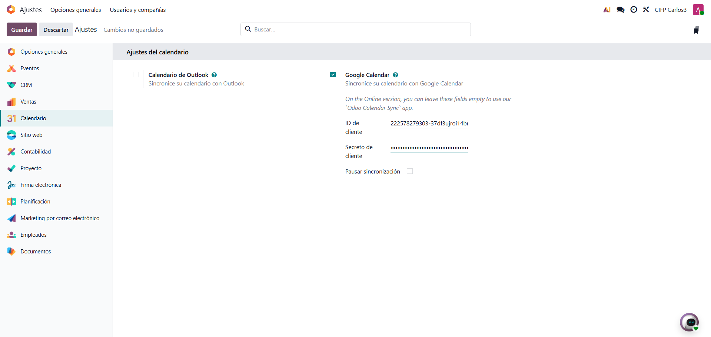

- **Odoo Meet** (videollamadas) o enlaces externos.

    Al hacer click en calendario nos da la opcion de crear evento, donde tenemos muchas opciones, tabien podemos hacer un enlace para una videollamada 

    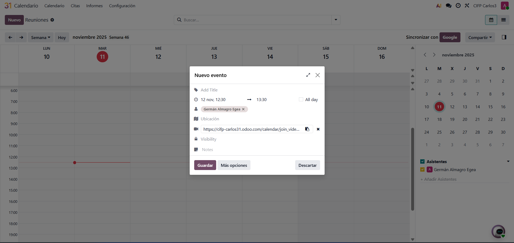

- **Módulo Citas** (Enterprise): enlaces públicos, buffers, preguntas previas.

    El modulo de ciras podemos ofrecer diversos servicios

    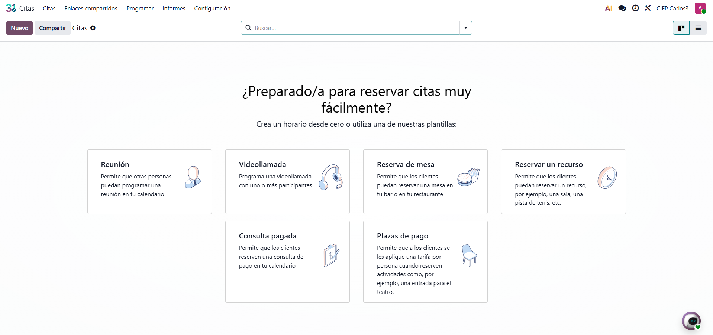

    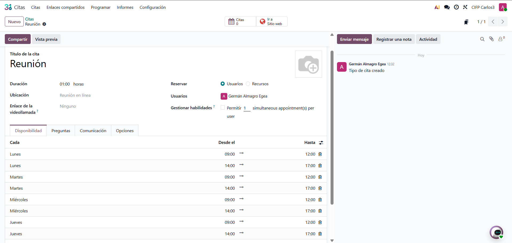