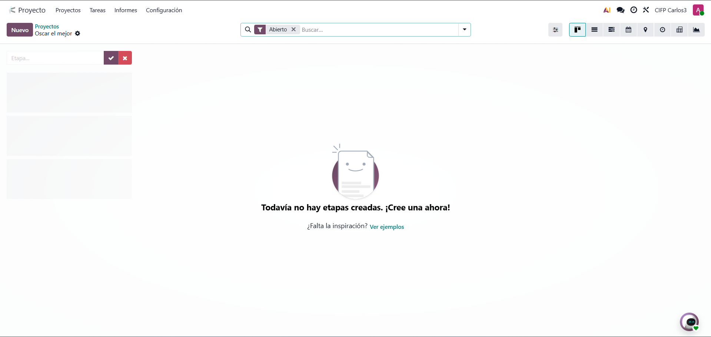
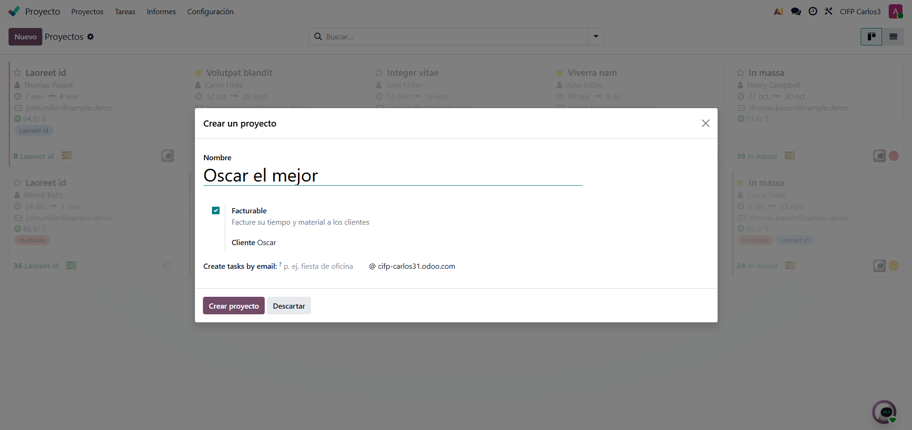
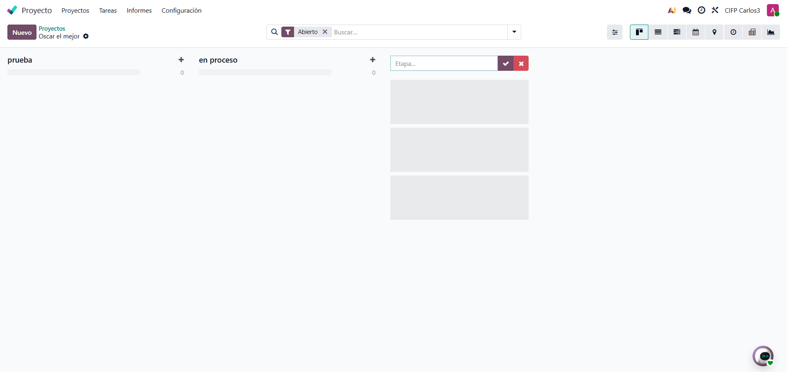
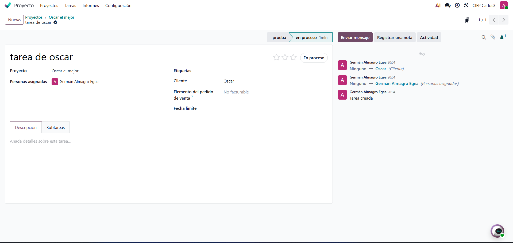
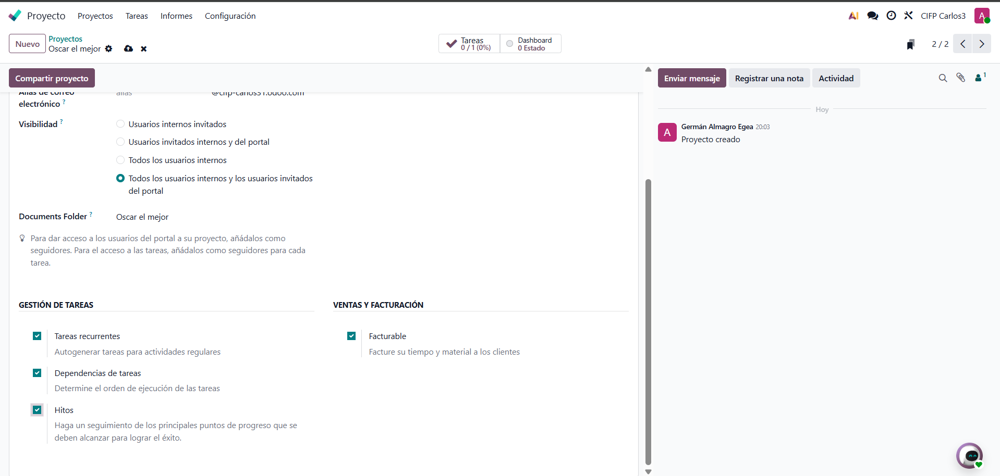
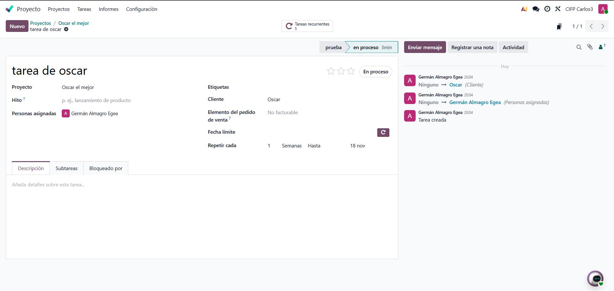
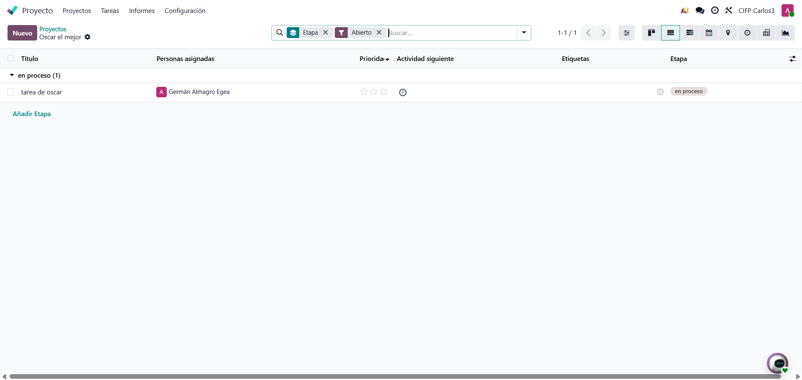
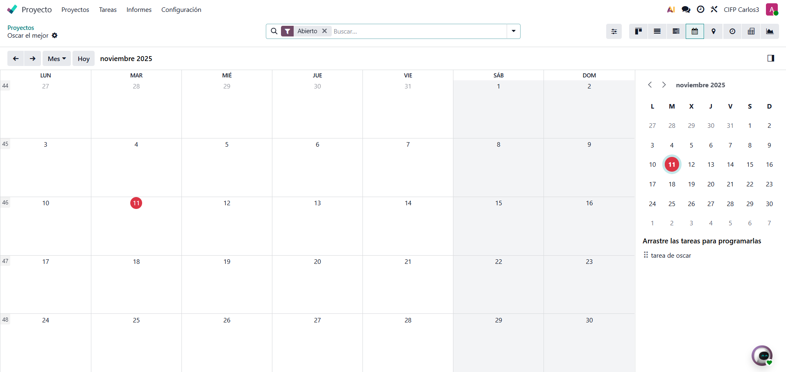

# 08 — Proyectos (Kanban)

- Proyectos, etapas, tareas, **subtareas**.

    Desde el menu, entramos a proyectos y creamos uno nuevo

    

    

    En el proyecto podemos ir creando etapas, las podemos clasificar como en proceso o finalizadas

    

    Tambien podemos crear subcarpetas 

    

- **Tareas recurrentes**, **dependencias**, **hitos**.

    Para activar las tareas recurrentes dependecias e hitos debemos ir a las opciones de nuestro proyecto y activarlas

    

    Para activar una tarea recurrente le darmos a la rueda que aparece en la derecha 

    

    En la pestaña que pone bloquedao por, podemos elegir que tareas que tarean tienen que hacerse antes que otras

    

    Para los hitos, en los ajustes sirven para tener puntos clave, sirven para controlar el progreso de las tareas

    

- Vistas: tarjetas, lista, calendario propio.

    Podemos tambien cambiar la vista de los proyectos, y utilizar el que nosotros eligamos 

    

    Tambien podemos utilizar la vista calendario, que es unico para el proyecto 

    

**calificación del cliente**.

    Esta opcion es muy util para recibir el feedback de los clientes 

    

