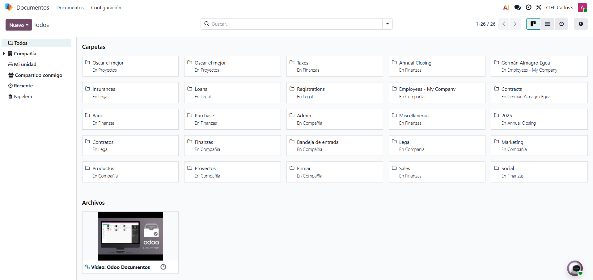
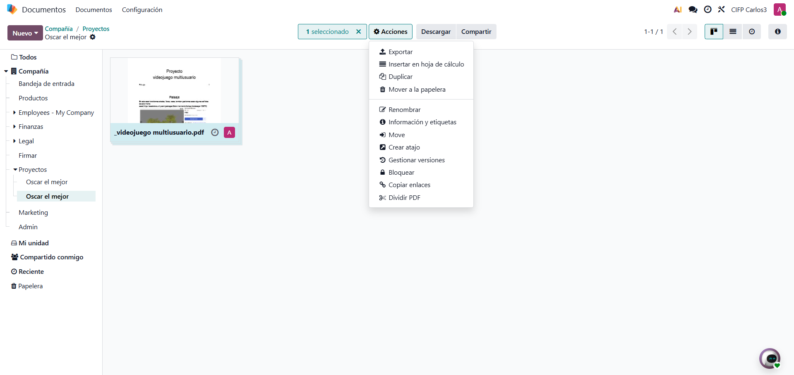
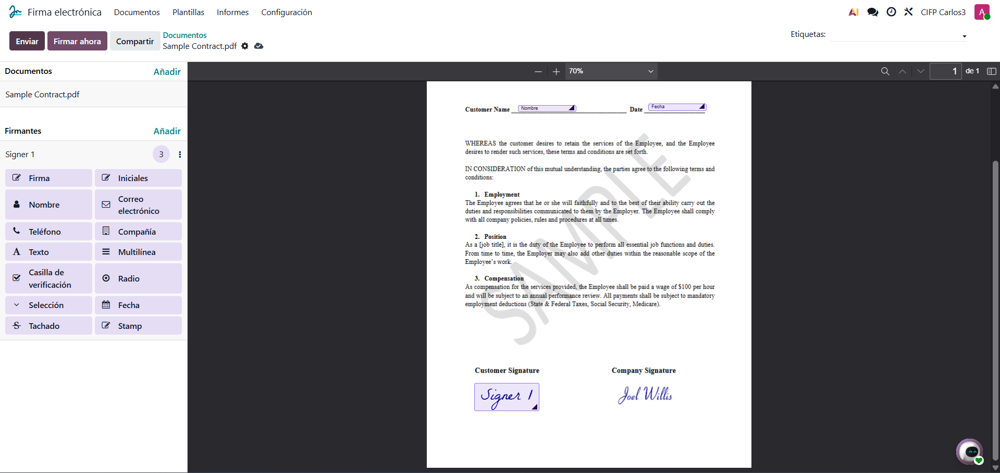
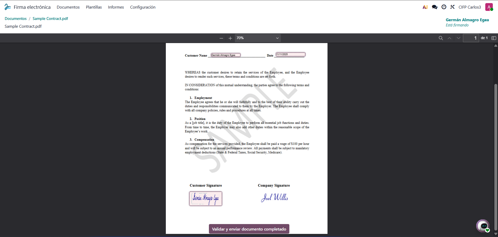
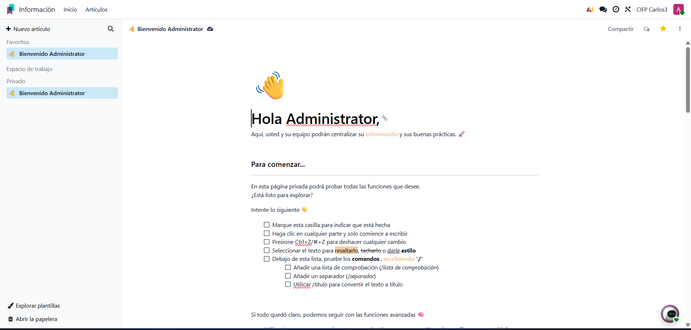
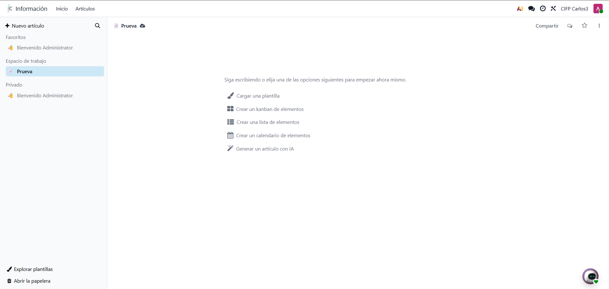
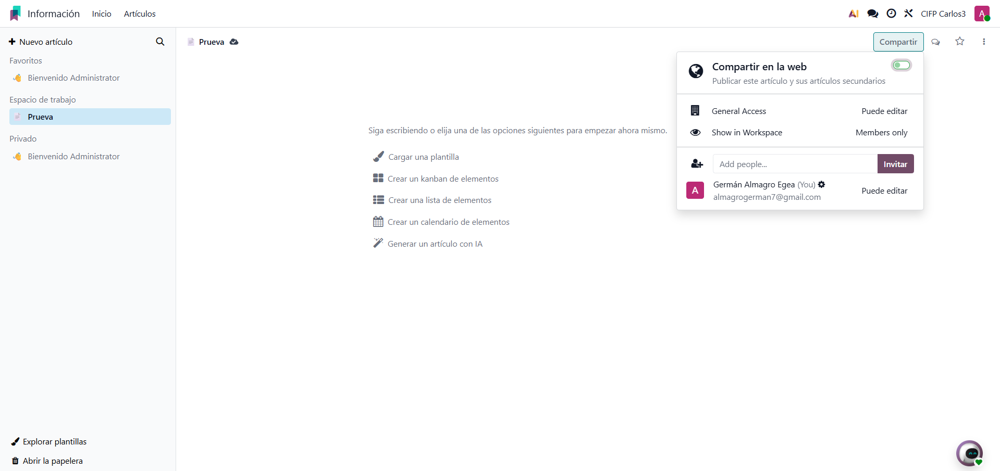
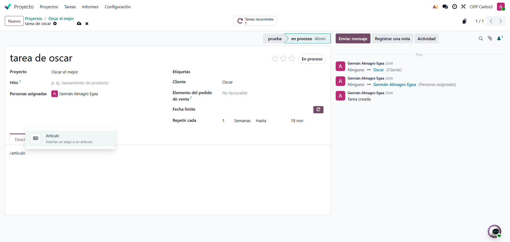

# 09 — Documentos, Firma e Información (Knowledge)

- **Documentos**

    En el modulo de documentos podemos digitalizar todos los documentos de la empresa. 

    Podemos tener documentos de proyectos, modulos o empleados. 

    

     

- **Firma electrónica**

    Dentro del modulo de firma electronica, podemos insertar las opciones que nos da para poner el nombre, fecha incluso para firmar

      

      

- **Información (Knowledge)**

    El modulo informacion, nos permite ver la informacion de la empresa, crearemos un espacio de trabajo 

     

      

      Podemos compartir el espacio de trabajo y cambiar la visibilidad 

       

       Podemos tambien vincular la wiki en algunas tareas de nuestros proyectos

        

