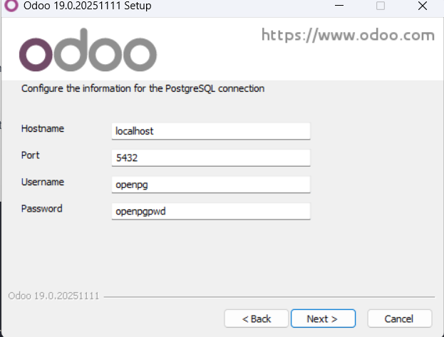
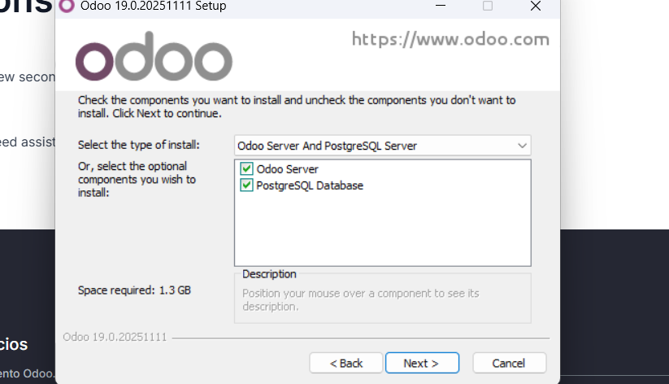

# 05 — Instalación de Odoo

1. Ejecutamos como administrador, elegimos el idioma que utilizemos, en este caso sera el ingles, aceptamos la licencia 
   - 

   - 

   Y esperamos a que finalice la descarga

   

