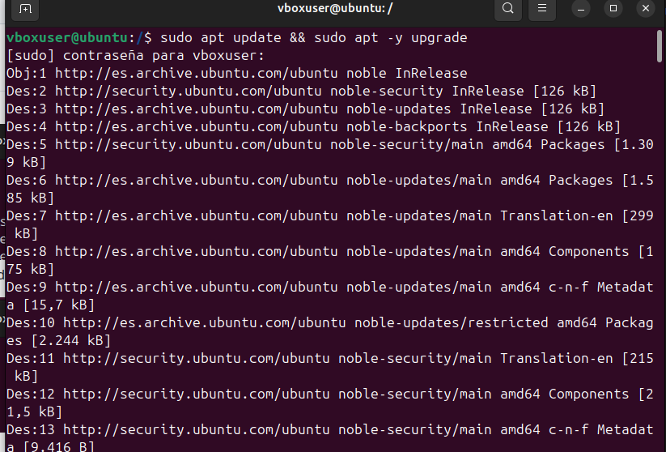
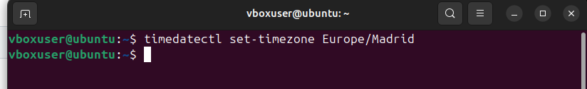

# 03 — Preparación del sistema

1. Actualiza índices y paquetes:
   ```bash
   sudo apt update && sudo apt -y upgrade
   ```
   

2. Configura zona horaria e idioma si procede.

   


> Resultado esperado: sistema actualizado y listo para instalar dependencias.
